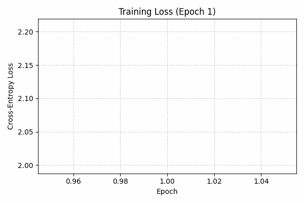
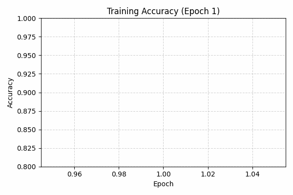
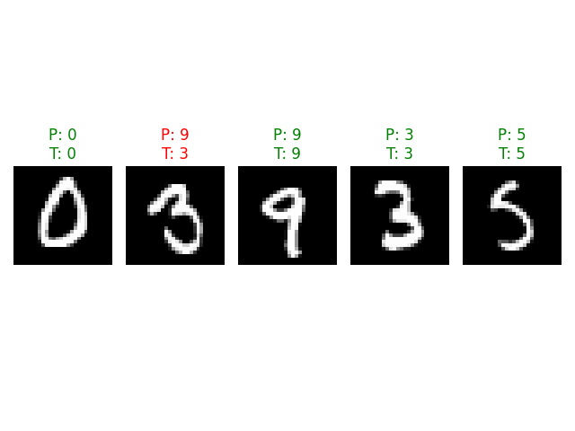

# Neural-Network-From-Scratch

A deep neural network built in Python from scratch, using only NumPy and CuPy, capable of classifying handwritten digits with high accuracy.

## A Visual of the training process
|Loss Evolution|Accuracy Evolution|
|--------------|------------------|
|||

## Prediction Samples
<p align="center">
  
</p>

## Performance for various settings

<table>
<tr>
<th>Sample Model 1</th>
<th>Sample Model 2</th>
</tr>
<tr>
<td>

| Layer | Size | Activation |
|:------|:----:|:-----------|
| Input | 784 | – |
| Hidden 1 | 100 | ReLU |
| Hidden 2 | 100 | ReLU |
| Output | 10 | Softmax |
<br>
<b>Accuracy:</b> 97.1%

</td>
<td>

| Layer | Size | Activation |
|:------|:----:|:-----------|
| Input | 784 | – |
| Hidden 1 | 10 | ReLU |
| Output | 10 | Softmax |
<br>
<b>Accuracy:</b> 98.1%

</td>
</tr>
</table>

> *Demonstrating two example architectures trained using the same generalized network code. Note: Final accuracy can vary between training runs due to random weight initialization.*

## Key features

- **Built Entirely from Scratch:** Implemented using only Python, NumPy, CuPy to demonstrate a fundamental understanding of deep learning mechanics. No PyTorch, TensorFlow, or Keras were used.
- **GPU Acceleration:** Leverages CuPy for significant GPU acceleration over the standard NumPy implementation.
- **Generalized Architecture:** Architected to support a variable number of hidden layers and a variable number of neurons in each layer.
- **Object-Oriented Design:** Structured with clean, modular classes for Layers, the Model, and the training process.
- **Implementation of Core Algorithms:**
  - Forward Propagation for inference.
  - Backpropagation to calculate gradients efficiently.
  - Adaptive Moment estimation (Adam) for weight optimization.
- **(Future-proofed) Extensible Components:** The design allows for the easy addition of different activation functions and loss functions.

## Getting Started

### Prerequisites

Ensure you have Python 3.10+ installed.

### Installation

1. Clone the repository:
   ```sh
   git clone https://github.com/Jedop/Neural-Network-From-Scratch.git
   cd Neural-Network-From-Scratch
   ```
2. Install the required dependencies:
   ```sh
   pip install -r requirements.txt
   ```

### Usage

The core logic can be explored in the Jupyter Notebook. For training and testing from the command line, use the following scripts.

1. Train the network:
   ```sh
   python train.py
   # or, for an example with custom arguments
   python train.py --lr 0.001 --epochs 11 --batch_size 256 --layers 2 --size 100 100 --activation relu sigmoid softmax
   ```

2. Test the network:
   ```sh
   python test.py
   ```

3. Look at Sample Predictions:
   ```sh
   python predict.py
   ```

## How it works

The network is trained using the following process:

1.  **Initialization:** Weights and biases for all layers are initialized using He initialization to aid convergence with ReLU activations.
2.  **Forward Pass:** For each input image, the data flows through the network layer by layer. Each layer performs a linear transformation (`Z = W*A + b`) followed by a non-linear activation function (e.g., ReLU or Softmax).
3.  **Loss Calculation:** The output from the final (Softmax) layer is compared to the true label using the Categorical Cross-Entropy loss function.
4.  **Backward Pass (Backpropagation):** The gradient of the loss is calculated with respect to the network's parameters (weights and biases). This is done efficiently by moving backward from the final layer, applying the chain rule at each step.
5.  **Parameter Update:** The weights and biases are updated using Adam.

## Future Work

- [ ] Add regularization techniques like Dropout and L2 regularization to combat overfitting.
- [ ] Generalize the code to easily swap in different loss functions (e.g., MSE).


